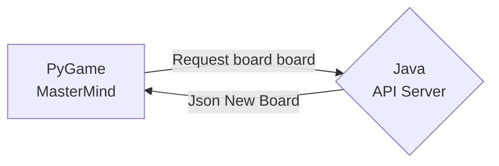
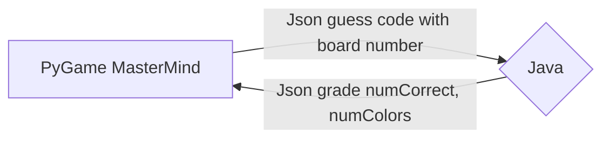
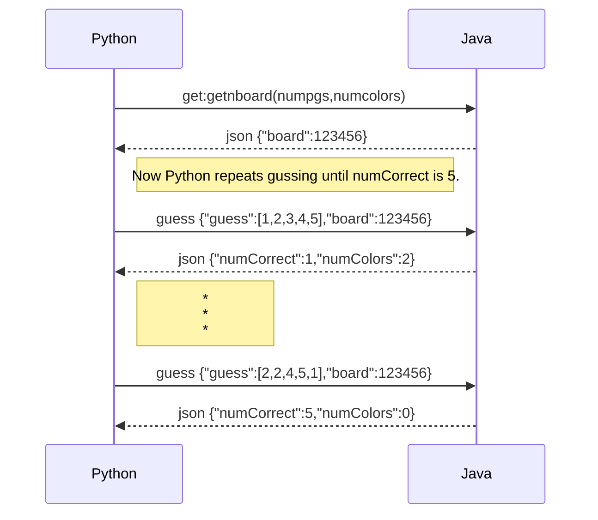

# PyGameUsingJavaAPIServer
WIP: Python Game graphic MasterMind game to call Java SpringBoot API to generate the game board and the do the grading.

Just wanting to start learning micro-services and create ~RESTful Java with SpringBoot.

# Two URL's gen and guess
* localhost:8080/mastermind/genboard

* localhost:8080/mastermind/guess with json

# UML Sequence Diagram

